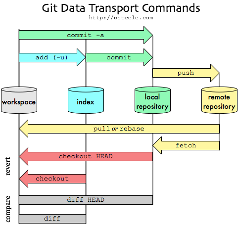

# Tutorial for the python Matasano challenges

This tutorial is meant as an easy-to-follow guide to contributing to the
python Matasano challenges. It covers all parts of the development process and
can be used as a reference for the various aspects.

A lot of the workflow included here is how I like to organise my work.
However, Git can be used in many different ways, and you should use it however
you feel happiest. Though I would strongly recommend getting into good habits
earlier on and trying to use git to its fullest.

### Table of contents
<!-- MarkdownTOC depth=3 bracket=round autolink=true -->

- [The Scenario](#the-scenario)
- [The Setup](#the-setup)
  - [Cloning & forking](#cloning--forking)
  - [Making changes & committing](#making-changes--committing)
  - [Pushing & pulling](#pushing--pulling)
- [Working on code](#working-on-code)
  - [Packages in python](#packages-in-python)
  - [Organising your work](#organising-your-work)
- [Submitting your Changes](#submitting-your-changes)
  - [Pull requests](#pull-requests)
  - [Updating the pull request (solving merge conflicts)](#updating-the-pull-request-solving-merge-conflicts)
- [Misc/Extras](#miscextras)
  - [`.gitconfig` file](#gitconfig-file)
  - [Bash prompt](#bash-prompt)

<!-- /MarkdownTOC -->


## The Scenario

You have some annoying colleague who insists that learning git is unnecessary
and has spent the past year working on a thesis which is just a single .tex 
monstrosity. You think it's time to teach them a lesson...

The plan is to write a program which takes in a .tex file and encrypts it
using a very simple cipher.

## The Setup

First things first, time to get everything organised. You decide to use the
[Matasano challenge](http://cryptopals.com/) solutions being worked on by [The
Lunctime Attack](https://github.com/TheLunchtimeAttack/matasano-challenges).
This should provide the cryptography you need to have some fun.

### Cloning & forking

Time to get a local copy of the repository:
```bash
$ git clone git@github.com:TheLunchtimeAttack/matasano-challenges.git
Cloning into 'matasano-challenges'...
...

```
(Don't have ssh keys set up with github? Find more info
[here](https://help.github.com/articles/generating-an-ssh-key/))

Great! So now we have the branch `master` set up to track from 
TheLunchtimeAttack's repository:
```bash
$ git remote -v
origin  https://github.com/TheLunchtimeAttack/matasano-challenges (fetch)
origin  https://github.com/TheLunchtimeAttack/matasano-challenges (push)
$ git branch -a
* master
  remotes/origin/HEAD -> origin/master
  remotes/origin/master

```
Hmm... but it would be nice to have our own version of the repository on
GitHub so we can share it with our colleagues later! We'll need to fork the
repository to our own GitHub account. Visit [the repo
page](https://github.com/TheLunchtimeAttack/matasano-challenges) and click the
fork button. Now we can add this repository as another 'remote' branch
in git.
```bash
$ git remote add me git@github.com:mygitusername/matasano-challenges.git
$ git remote -v
origin  https://github.com/TheLunchtimeAttack/matasano-challenges (fetch)
origin  https://github.com/TheLunchtimeAttack/matasano-challenges (push)
me git@github.com:mygitusername/matasano-challenges.git (fetch)
me git@github.com:mygitusername/matasano-challenges.git (push)

```
Cool! So git now has two possible remote repositories it knows about.

Let's make a new *local* branch, and set it to track to a *remote* branch
on my fork:
```bash
$ git checkout -b tutorial # Creates a new branch and switches to it.
Switched to a new branch 'tutorial'
$ git push -u me tutorial # Creates a new branch in the repo 'me' called tutorial
...
To git@github.com:mygitusername/matasano-challenges.git
 * [new branch]      tutorial -> tutorial
Branch tutorial set up to track remote branch tutorial from me. 
```
We can find out even more information if we want:
```bash
$ git remote show me
* remote me
  Fetch URL: git@github.com:mygitusername/matasano-challenges.git
  Push  URL: git@github.com:mygitusername/matasano-challenges.git
  HEAD branch: master
  Remote branches:
    master   tracked
    tutorial tracked
  Local branch configured for 'git pull':
    tutorial merges with remote tutorial
  Local refs configured for 'git push':
    master   pushes to master   (up to date)
    tutorial pushes to tutorial (up to date)
```

Aah. Too much information...


### Making changes & committing

Time to start making some changes. A good starting point is a readme file
explaining the project. Once that's done, we can add it:
```bash
$ git status
On branch tutorial
Your branch is up-to-date with 'me/tutorial'.
Untracked files:
  (use "git add <file>..." to include in what will be committed)

    python/TUTORIAL.md

nothing added to commit but untracked files present (use "git add" to track)

$ git add python/TUTORIAL.md
$ git status
On branch tutorial
Your branch is up-to-date with 'me/tutorial'.
Changes to be committed:
  (use "git reset HEAD <file>..." to unstage)

    new file:   python/TUTORIAL.md
```

Ok, so we'll commit those change with `git commit` and write a nice commit
message.

### Pushing & pulling

If we don't have a tool to display Markdown, we can always push it to the repo
and see how it would look like.
```bash
$ git push tutorial
```

Since we set the branch tutorial to automatically push to the repository `me`,
this worked fine. However, if we want, we can be more specific and write `git
push me tutorial`.

As an aside, here is a lovely diagram giving an overview of the different git
commands:


Now that we've pushed our recent changes to our own fork of the repo. Suppose
we now want to check whether there have been any changes to the main repo
with new functionality we want to use:
```bash
$ git pull origin master
From https://github.com/TheLunchtimeAttack/matasano-challenges
 * branch            master     -> FETCH_HEAD
Already up-to-date.
```
Everything up-to-date for now, that's fine. If not we could decide whether it
would be worth merging the changes (a quick `git log master` to see what
recent commits have done) and then `git merge master` to bring the new changes
from `master` into our `tutorial` branch.

## Working on code

Now that the respository is all set up, time to start writing some code.
First thing to do is read the [README](README.md) to see if there's any
relevant information.

### Packages in python

From the README:

> Due to the folder structure, you need to run all commands from this folder.
For example:
```bash
$ pwd
~/matasano-challenges/python
$ python
>>> import matasano.set1.c1
SSdtIGtpbGxpbmcgeW91ciBicmFpbiBsaWtlIGEgcG9pc29ub3VzIG11c2hyb29t 
```  


So if we create a new directory for our program, we can use it in the same way.
```bash
$ mkdir tutorial
$ cd tutorial
~/work/matasano/python/tutorial
$ touch __init__.py
```
This created a new directory called `tutorial`, and `touch __init__.py` creates an
empty file called `__init__.py` which is needed by python to understand that 
the `tutorial` folder should be treated like a python package.

We can also make a small python file to check that it can import the matasano 
files properly.

```python
# python/matasano/tutorial/example.py
from matasano.util.byte_xor import byte_list_xor
import sys

if __name__ == "__main__":
    if len(sys.argv) != 2:
        print("Usage:\n\t python -m example.py <string to encrypt>")
        quit()

    input_str = sys.argv[1]

    # Convert string to list of bytes
    byte_list_input = [ord(c) for c in input_str]

    # XOR the string with the byte 1 (flips last bit)
    output_list = byte_list_xor(byte_list_input, [1]*len(input_str))

    # Convert list back to string
    output_str = "".join(chr(b) for b in output_list)

    print("The encrypted string is: {}".format(output_str))
```

The first `if` statement here makes sure the code only runs when we call it
directly (and not, for example, when imported by an external package). 

The rest of the example takes the string provided by the user as input and
XORs each byte with 1. Let's see it in action:

```bash
$ python -m tutorial.example 'Hello, world!'
The encrypted string is: Idmmn-!vnsme 
```

It works! We used the `python -m` command while in the `python/` directory to
tell python to import our file `example` from the `tutorial` package/folder.

### Organising your work

Now we have a good base for writing our code, it's important to save our
progress by creating a commit.

We want to treat the `tutorial` branch we created as a sort of pseudo-master
branch. That is, it's best to make changes in another new branch, and only 
merge them back to the `tutorial` branch once we are confident they are good.

This means that if we want to go back and work on some other part of the code,
we don't need to worry about whether the current changes have broken
something.

Even though we've made changes, have new untracked files (and may have made
staged or unstaged changes to tracked files) git is happy to let us change to
a new branch.

This is because there is no confusion over what to do with the recent changes.

However, suppose we tried to change to a branch which has a different state:
```bash
$ git checkout master
error: Your local changes to the following files would be overwritten by checkout:
  python/TUTORIAL.md
Please, commit your changes or stash them before you can switch branches.
Aborting
```
Git doesn't like it! Since the version of `python/TUTORIAL.md` in the master
branch you want to checkout is different than the version you made changes to,
so it can't handle it.

Create a new branch which will be dedicated to writing the code:
```bash
$ git checkout -b code
M python/TUTORIAL.md
Switched to a new branch 'code'
```
Note that it tells you about modifications to *tracked* files, but doesn't
care about untracked files (they are ignored for now).

Add and commit the new files we added and we're good to continue.

## Submitting your Changes

Once you've finished writing your code, you may want them to be merged into
the main repository.

### Pull requests

The way to achieve this is with a pull request. Pull requests are GitHub's way
of doing push/pull when you do not have permission to directly push to a
repository.

(Think of a pull request as requesting that the owner of the respository pulls
your changes into their branch.)

To achieve this, you can either navigate to the [New Pull Request](https://github.com/TheLunchtimeAttack/matasano-challenges/pull/new/master)
page, or usually you can click a button when looking at the branch you
want to merge.

You can select the *base fork* which is the destination fork (where the
changes are pulled into), and the *head fork* (the changes to include/pull
from). GitHub will give you a nice overview of the changes made, the commits
this includes etc. You should scan over those changes quickly to check 
everything is included.

Also, hopefully GitHub will tell you 

>  :heavy_check_mark: Able to merge. These branches can be automatically merged. 

Which means that the owner of the base fork can merge the pull request without
any changes. If not, then you will have to manually merge yourself before
proceeding.

Suppose we are still in the `tutorial` branch locally, and wish to submit a 
pull request for this branch in to `master` of TheLunctimeAttack's repo.

First thing to do, is create a *new* branch dedicated to the pull request
```bash
$ git checkout -b pr_tutorial
```
The reason for doing this is that a pull request automatically includes any
new commits added to that branch. This is a very useful feature since you can
incorporate any new feedback without needing to submit a new pull request.
However, it is best to keep this as a separate branch so you don't add any new
changes to the pull request accidentally.

As before, we need to push this branch to our fork:
```bash
$ git push -u me pr_tutorial
```

And we can now go and create the pull request as above by visiting 
[New Pull Request](https://github.com/TheLunchtimeAttack/matasano-challenges/pull/new/master).

In creating the pull request, the title of the pull request will appear in 
the commit message of the merge when the pull request is merged.
Therefore, the title should describe what your pull request does.

The box for the description is to give any extra information you think might
be useful for people reviewing the pull request.

### Updating the pull request (solving merge conflicts)

Later on, you notice that changes made to the code have resulted in merge
conflicts with your pull request. Luckily, we can make these changes on
the fly without needing to make a new branch.

First, merge the changes locally:
```bash
$ git checkout pr_tutorial
$ git pull origin master # update the master branch from the TLA repo
$ git merge master
Auto-merging python/tutorial/example.py
CONFLICT (content): Merge conflict in python/tutorial/example.py
Recorded preimage for 'python/tutorial/example.py'
Automatic merge failed; fix conflicts and then commit the result.
```

At this point you will get merge conflicts and need to manually rectify them.

Running `git status` helps to show where the merge conflicts were:
```bash
$ git status
On branch pr_tutorial
You have unmerged paths.
  (fix conflicts and run "git commit")

Unmerged paths:
  (use "git add <file>..." to mark resolution)

  both modified:   tutorial/example.py

no changes added to commit (use "git add" and/or "git commit -a")
```

The 'both modified' is telling you that to merge you need to decide
which code you want to keep, the code introduced by `master` or the 
code in `pr_tutorial`

**Note**: if you make a mess of the merge and want to abandon it, you
can run `git merge --abort` to take you back to the pre-merged state.

We can run `git diff` to see where the merge conflicts are:

```bash
$ git diff tutorial/example.py 
diff --cc python/tutorial/example.py
index 22abb6b,fc8bc2d..0000000
--- a/python/tutorial/example.py
+++ b/python/tutorial/example.py
@@@ -11,8 -11,8 +11,13 @@@ if __name__ == "__main__"
      # Convert string to list of bytes
      byte_list_input = [ord(c) for c in input_str]
  
++<<<<<<< HEAD
 +    # XOR the string with the byte 2 (flips secondd last bit)
 +    output_list = byte_list_xor(byte_list_input, [2]*len(input_str))
++=======
+     # XOR the string with the byte 3 (flips last two bits)
+     output_list = byte_list_xor(byte_list_input, [3]*len(input_str))
++>>>>>>> master
  
      # Convert list back to string
      output_str = "".join(chr(b) for b in output_list)
```

The code is separated into `<<<< ... ==== .... >>>>` blocks.
The first block is showing the changes introduced in `HEAD`
(these refer to the branch you are currently on) whereas the
second block shows the changes introduced in `master`.

Note that all git has done is annotate the file to show what you
need to resolve *manually*. The `<<<<...` parts have to be removed.

You edit the file and decide that you'd rather keep the changes from
`master`. To finish the merge:
```bash
$ git add tutorial/example.py
$ git status
On branch pr_tutorial
All conflicts fixed but you are still merging.
  (use "git commit" to conclude merge)

Changes to be committed:

  modified:   tutorial/example.py
$ git commit
Recorded resolution for 'python/tutorial/example.py'.
[pr_tutorial 88aa6d4] Merge branch 'master' into pr_tutorial
``` 
Git will automatically create a merge message for you (feel free to add some
details if you made significant changes in the merge).

You can see what happened with the merge using `git log --graph`:
```bash
$ git log --graph
*   commit 88aa6d4342b8707a11ffc1614fe4fa4d072884bf
|\  Merge: 07096ba 1355ea6
| | Author: Sam Scott <sam.scott89@gmail.com>
| | Date:   Fri Feb 26 12:17:30 2016 +0000
| | 
| |     Merge branch 'master' into pr_tutorial
| |   
| * commit 1355ea6276a50e9540201bdb2184a44751101224
| | Author: Sam Scott <sam.scott89@gmail.com>
| | Date:   Fri Feb 26 12:07:38 2016 +0000
| | 
| |     Change example XOR to flip 2 bits.
| |     
| |     (Making changes to illustrate merge conflicts)
| |   
* | commit 07096ba58e61580168c85dbcbecb107824096871
|/  Author: Sam Scott <sam.scott89@gmail.com>
|   Date:   Fri Feb 26 12:08:31 2016 +0000
|   
|       Change XOR to flip second last bit
|       
|       Making change to cause merge conflict as an example.
|  

```

Once again, push these changes to the remote branch with `git push` and you
should see your recent merge commit added to the pull request automatically,
which is now ready to merge.

## Misc/Extras

A few bonus goodies.

### `.gitconfig` file

There are two important places git looks for config files: a global `~/.gitconfig`
and the project specific `project/.git/config`. The former is very useful for
setting up some useful configuration.

Searching for useful `.gitconfig` files will provide many results, but a couple of 
important ones are included here:

```yaml
[user]
        name = Your Name
        email = yourname@example.com
[core]
        editor = nano 
        whitespace = fix,-indent-with-non-tab,trailing-space,cr-at-eol
        excludesfile = ~/.gitignore
[github]
        user = gitusername
        token = ~/.ssh/id_ecdsa
[bitbucket]
        user = bbusername
        token = ~/.ssh/id_ecdsa
[push]
        default = tracking
[color]
        ui = auto
[color "branch"]
        current = yellow bold
        local = green bold
        remote = cyan bold
[color "diff"]
        meta = yellow bold
        frag = magenta bold
        old = red bold
        new = green bold
        whitespace = red reverse
[color "status"]
        added = green bold
        changed = yellow bold
        untracked = red bold
```

The `default = tracking` option means that doing a `git push` will only push
the current branch if it has a remote branch it is tracking.

For many other config options, do `man git config`.

### Bash prompt

One *incredibly* useful thing to have, is the name of the current git branch
shown in your bash prompt (the command line).

You can achieve this by editting the '~/.bashrc' file.

Again, searching for 'best bash prompts' will probably return some great examples, 
and some tools to customise, but for reference, here's mine:
```bash
function git-branch-name {
  git symbolic-ref HEAD 2>/dev/null | cut -d"/" -f 3
}
function git-branch-prompt {
  local branch=`git-branch-name`
  if [ $branch ]; then printf " [%s]" $branch; fi
}

PS1='\[\e[0;32m\]\u\[\e[m\] \[\e[1;34m\]$(pwd -P)\[\e[m\] $(git-branch-prompt) \[\e[1;32m\]\$\[\e[m\] \[\e[1;37m\]'

```
The best part is the `git-branch-prompt` function which puts the name of the
current branch into the prompt. This makes it much easier to work with
different branches since you don't need to remember where you are!
